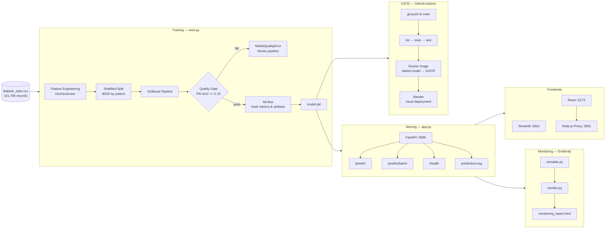

# IE-MLOps-Group-Project-Team3

**Hospital Readmission Risk Prediction** — An end-to-end MLOps system for proactive patient care.


---

## Project Overview

This project builds a machine learning system to predict 30-day readmission risk for diabetic inpatients. Risk scores are served via a FastAPI REST API with SHAP explainability, a Streamlit clinical dashboard, and a React + Node.js full-stack frontend.

- **Dataset**: Diabetes 130-US Hospitals (UCI ML Repository, id 296) — Strack et al., 2014
- **Target**: Binary classification — readmitted within 30 days (yes/no)
- **Model**: XGBoost pipeline tracked with MLflow, quality-gated (PR-AUC ≥ 0.15)
- **Data Versioning**: DVC tracks raw and processed datasets (`data/diabetic_data.csv.dvc`, `data/processed.dvc`)
- **Deployment**: FastAPI, Streamlit, and the React + Node stack can be deployed to Render or **Hugging Face Spaces** (see `Dockerfile.hf` and `.github/workflows/deploy-hf.yml`). **For project review and demos, please run the stack locally** using [Quick Start](#quick-start) below — Render’s **free tier** may spin down, cold-start slowly, or return gateway errors (e.g. 502/520), so we do **not** publish live URLs here.
- **Walkthrough**: [WALKTHROUGH_EN.md](WALKTHROUGH_EN.md)

---

## Team

Marian, Marco, Yaxin, Lorenz, Jorge, Omar

---

## Project Roadmap

| Phase | Module | Description | Contributors |
| ----- | ------ | ----------- | ------------ |
| 1 | [01-initial-notebook](01-initial-notebook/README.md) | EDA, baseline Logistic Regression | Marian, Lorenz |
| 2 | [02-data-sampling-feature](02-data-sampling-feature/README.md) | Feature engineering, patient-level split | Yaxin, Omar |
| 3 | [03-experiment-tracking](03-experiment-tracking/README.md) | MLflow, XGBoost/LightGBM, Optuna tuning | Marco, Yaxin, Jorge |
| 4 | [04-deployment](04-deployment/README.md) | FastAPI model serving | Lorenz, Marco |
| 5 | [05-monitoring](05-monitoring/README.md) | Drift detection with Evidently | Marian, Jorge |
| 6 | [06-cicd](06-cicd/README.md) | CI/CD, Docker, GHCR, Render, Streamlit UI, React dashboard | Yaxin, Omar |

---

## Repository Structure

```text
├── 01-initial-notebook/           # EDA & baseline model
├── 02-data-sampling-feature/      # Feature engineering
├── 03-experiment-tracking/        # MLflow experiments
├── 04-deployment/                 # FastAPI serving (standalone)
├── 05-monitoring/                 # Drift detection (standalone)
├── 06-cicd/                       # Production CI/CD module
│   ├── train.py                   # XGBoost training + quality gate
│   ├── app.py                     # FastAPI service (SHAP, logging, CORS)
│   ├── streamlit_app.py           # Clinical Streamlit dashboard
│   ├── test_api.py                # API integration tests
│   ├── test_train.py              # Unit tests for train.py
│   ├── config.yaml                # Features, hyperparameters, quality gate threshold
│   ├── Dockerfile                 # Production container
│   ├── requirements.txt
│   ├── data/
│   │   └── predictions.log        # Append-only prediction audit log (CSV)
│   ├── models/                    # Saved MLflow model artifact
│   └── frontend/                  # React + Node.js dashboard
│       ├── client/                # Vite + React (7 pages, 6 settings tabs)
│       ├── server/                # Express proxy (Node.js, production)
│       ├── Dockerfile
│       └── docker-compose.yml
├── .github/workflows/
│   ├── ci-cd.yml                  # Main pipeline (lint → test → build → deploy)
│   ├── train.yml                  # Reusable training job
│   └── deploy-hf.yml             # Hugging Face Spaces deployment
├── data/
│   ├── diabetic_data.csv          # Raw dataset (download from UCI)
│   ├── diabetic_data.csv.dvc      # DVC tracking file
│   ├── processed.dvc              # DVC tracking for processed data
│   ├── IDS_mapping.csv
│   └── processed/                 # train.csv, val.csv, test.csv
├── docker-compose.yml             # Full stack: Postgres + MLflow + FastAPI + Frontend
├── Dockerfile.hf                  # Hugging Face Spaces deployment image
├── render.yaml                    # Render.com deployment config
├── WALKTHROUGH_EN.md              # Full technical walkthrough
└── README.md
```

> **Note on repeated filenames**: `app.py`, `train.py`, and `test_api.py` appear in modules 04, 05, and 06. Each version intentionally evolves — basic serving → monitoring hooks → CI/CD + SHAP integration.

---

## Key Deliverables

| Deliverable | Status |
| :--- | :---: |
| Model training with quality gate (`train.py`, MLflow, PR-AUC ≥ 0.15) | ✅ |
| FastAPI serving with SHAP explainability and prediction logging (`app.py`) | ✅ |
| Unit + integration tests | ✅ |
| Dockerfile | ✅ |
| CI/CD workflow (lint → test → build → push) | ✅ |
| DVC data versioning (`data/*.dvc`) | ✅ |
| Remote MLflow tracking server (Postgres + docker-compose) | ✅ |
| Render deployment manifest (`render.yaml`) | ✅ |
| Hugging Face Spaces deployment (`Dockerfile.hf`, `deploy-hf.yml`) | ✅ |
| Streamlit clinical dashboard | ✅ |
| React + Node.js full-stack frontend (7 pages, 6 settings tabs) | ✅ |

---

## Quick Start

### 1. Clone and set up

```bash
git clone https://github.com/NOSIEMPRE/Hospital-Prediction-System.git
cd Hospital-Prediction-System
```

It is recommended to create a dedicated virtual environment to avoid conflicts with your base environment:

```bash
# Option A — conda
conda create -n mlops python=3.11
conda activate mlops

# Option B — venv
python -m venv .venv
source .venv/bin/activate   # Mac/Linux
```

Then install dependencies:

```bash
pip install -r 06-cicd/requirements.txt
```

> Remember to activate the environment (`conda activate mlops` or `source .venv/bin/activate`) in every new terminal window before running any commands.

### 2. Download data

Download [Diabetes 130-US Hospitals](https://archive.ics.uci.edu/dataset/296) and place `diabetic_data.csv` in `data/`.

### 3. Train model (MLflow)

```bash
cd 06-cicd
python train.py
```

This will:

- Run feature engineering and patient-level train/val split
- Train an XGBoost pipeline tracked in MLflow (`mlruns/`)
- Enforce the quality gate (PR-AUC ≥ 0.15) — raises `ModelQualityError` if not met
- Save the model artifact to `models/model/` and write `run_id.txt`

**View MLflow experiment UI** (optional, open in a separate terminal):

```bash
cd 06-cicd
mlflow ui --backend-store-uri sqlite:///mlflow.db
# → http://localhost:5000
```

Browse runs, compare metrics (PR-AUC, ROC-AUC), and inspect logged parameters.

### 4. Run FastAPI

```bash
cd 06-cicd
python app.py
# → http://localhost:9696
```

Key endpoints:

| Endpoint | Method | Description |
| --- | --- | --- |
| `/health` | GET | Model status and run ID |
| `/predict` | POST | Single patient risk score + SHAP values |
| `/predict/batch` | POST | Batch predictions |
| `/docs` | GET | Interactive API documentation (Swagger UI) |

**Interactive API docs** — open in browser after starting:

```text
http://localhost:9696/docs
```

Fill in patient fields and test `/predict` directly from the browser — no curl needed.

**Prediction audit log** — every call to `/predict` is appended to:

```bash
cat 06-cicd/data/predictions.log
```

**Test via curl:**

```bash
curl http://localhost:9696/health

curl -X POST http://localhost:9696/predict \
  -H "Content-Type: application/json" \
  -d '{
    "time_in_hospital": 3, "num_lab_procedures": 41,
    "num_procedures": 0, "num_medications": 8,
    "number_emergency": 0, "number_inpatient": 0,
    "number_outpatient": 0, "number_diagnoses": 9,
    "admission_type_id": 1, "discharge_disposition_id": 1,
    "admission_source_id": 7, "age": "[50-60)",
    "gender": "Female", "race": "Caucasian",
    "change": "Ch", "diabetesMed": "Yes",
    "A1Cresult": "not_tested", "max_glu_serum": "not_tested"
  }'
```

### 5. Run Streamlit dashboard

```bash
streamlit run 06-cicd/streamlit_app.py
# → http://localhost:8501
```

The sidebar lets you switch between **Local API** (`http://localhost:9696`, requires `app.py` running) and **Cloud API** (Render). Prefer **Local API** for demos: the cloud option is subject to cold starts and may intermittently fail on the free tier.

### 6. Run React frontend

For local development, only 2 terminals are needed — the Vite dev server proxies API calls directly to FastAPI:

```text
Browser (5173) → Vite proxy → FastAPI (9696)
```

#### Terminal 1 — FastAPI ML API (keep running from step 4)

```bash
cd 06-cicd
python app.py
# → http://localhost:9696
```

#### Terminal 2 — React client (UI)

```bash
cd 06-cicd/frontend/client
npm install
npm run dev
# → Open http://localhost:5173 in your browser
```

The Vite config includes a proxy that forwards `/api/*` to `http://localhost:9696`, so no Express server is needed for local dev.

> **Production**: In Docker/Render, the Express proxy (`server/`) sits between the React build and FastAPI (see `docker-compose.yml`).

### 7. Deploy to Render (CI/CD)

Render deployment is triggered automatically by the CI/CD pipeline on every push to `main`. To trigger manually:

1. Go to **GitHub Actions → CI/CD Pipeline**
2. Click **Run workflow**

The pipeline runs: lint → train → test → build Docker image → push to GHCR → deploy to Render.

### 8. Deploy to Hugging Face Spaces (alternative)

If Render's free tier is too small, the project can be deployed to Hugging Face Spaces:

1. Create a new HF Space (Docker SDK)
2. Add `HF_TOKEN` to your GitHub repo secrets
3. Set `HF_SPACE_NAME` repo variable (e.g., `your-username/Hospital-Prediction-System`)
4. The `deploy-hf.yml` workflow auto-deploys after successful CI/CD
5. Or push manually: `git push hf main`

The `Dockerfile.hf` runs both FastAPI and the React frontend in a single container using supervisord.

### 9. DVC data versioning

Data files are tracked with DVC. To pull data after cloning:

```bash
dvc pull
```

To track new data changes:

```bash
dvc add data/diabetic_data.csv
git add data/diabetic_data.csv.dvc
```

### 10. Run Evidently monitoring report

Evidently generates a static HTML report comparing training data distribution against production traffic. It does **not** require a running server.

```bash
cd 05-monitoring
python simulate.py   # simulate production traffic (calls the API ~100 times)
python monitor.py    # generate monitoring_report.html
open monitoring_report.html   # open in browser (Mac)
```

The report shows:

- Feature drift (KS test / chi-squared for each input feature)
- Target drift (has the readmission rate shifted?)
- Model performance metrics (precision, recall, F1)

> Evidently does not have a live web dashboard in this project — the output is a static HTML file generated on demand.

---

## Documentation

See [WALKTHROUGH_EN.md](WALKTHROUGH_EN.md) for a full technical walkthrough of the entire MLOps pipeline — from raw data to cloud deployment.

---

## Pipeline Architecture



---

## References

- Strack, B., et al. (2014). Impact of HbA1c Measurement on Hospital Readmission Rates. *BioMed Research International*.
- UCI Machine Learning Repository. (2014). Diabetes 130-US Hospitals.
- Huyen, C. (2022). *Designing Machine Learning Systems*. O'Reilly Media.
- IE University. (2026). *Machine Learning Operations* — Final Group Project.
